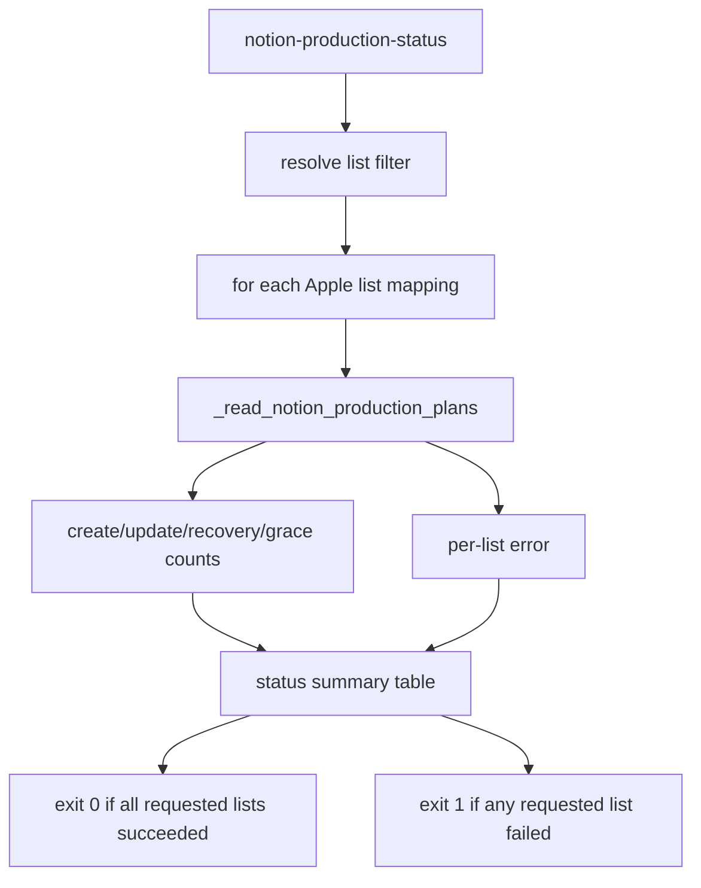

# Notion Reminders Production Status Command

## Summary

Add a read-only production status command that summarizes the allowlisted Notion Tasks to Apple Reminders production lists in one pass. The command should make the current production state easy to inspect without applying writes, weakening existing production gates, or requiring three separate list-scoped commands.

---

## Problem Frame

The production pilot has proven the gated one-list flow for `Life`, with `Life`, `Dissertation`, and `Academic` configured as the production allowlist. The remaining operator gap is status visibility: answering "where are we?" requires running `notion-production-plan` separately for each list and manually comparing create, baseline, update, recovery, and missing-side counts.

This plan keeps production mutation out of scope. It adds a report-only command over the existing read-only planning machinery so the next operator can see drift and enrollment readiness before choosing any explicit write command.

---

## Requirements

- R1. The CLI exposes a read-only `icloudbridge reminders notion-production-status` command that inspects every configured production mapping by default.
- R2. The command accepts optional list filters so an operator can inspect one or more allowlisted Apple Reminders lists without changing the allowlist contract.
- R3. The status output includes the Notion Area and summarized counts from create, update/baseline, identity recovery, and missing-side detection plans for each inspected list.
- R4. The status command performs no writes and does not accept `--apply`, `--confirm-production`, or expected-count write gates.
- R5. Failures for one list are surfaced in the report without hiding the status of other lists that were inspected successfully.
- R6. Existing production write commands and test-slice commands keep their current behavior and gates.

---

## Key Technical Decisions

- **Reuse production plan context:** Build the status command from `_read_notion_production_plans` so list allowlisting, Notion schema preflight, scoped Notion task selection, Apple list lookup, and local receipt scoping stay identical to existing production commands.
- **Keep status CLI-only for this slice:** Add the first status surface to the Typer CLI rather than the frontend or a daemon. The operator need is immediate terminal visibility, and the CLI already owns production guardrails.
- **Summarize counts rather than action details:** Print one compact per-list table with all action counts. Detailed action rows remain available through `notion-production-plan` when an operator needs to inspect individual rows.
- **Treat partial failures as command failure with useful output:** If any requested list fails preflight or lookup, the command should return non-zero after printing the failed list, while still showing successful list summaries collected before or after that failure.
- **No live write proof in implementation:** Verification should use unit tests, CLI help, compile checks, and existing mocks. Live Notion or Apple Reminders reads are optional operator checks, not part of this LFG implementation.

---

## High-Level Technical Design

The command reads the same context as `notion-production-plan`, but renders only summary counts. A small helper should convert the returned plan context into a stable row shape so tests can verify behavior without depending on Rich table internals.

---

## Implementation Units

### U1. Production Status Summary Model

- **Goal:** Add a small pure helper that summarizes one production plan context into counts suitable for CLI rendering and tests.
- **Files:** `icloudbridge/cli/main.py`
- **Patterns:** Follow `_print_create_plan`, `_print_update_plan`, `_print_identity_recovery_plan`, and `_print_deletion_grace_plan` for existing count names.
- **Test Scenarios:**
  - A context with create/update/recovery/grace plans produces counts for `CREATE_NOTION`, `NEEDS_BASELINE`, `UPDATE_APPLE`, `UPDATE_NOTION`, `CONFLICT`, `RECOVER_APPLE_ID`, `UNRECOVERED`, missing-side markers, and `UNTRACKED`.
  - The summary includes the Apple list name and mapped Notion Area.
- **Verification:** Focused unit tests in `tests/test_notion_readonly_matching.py` or a new CLI-focused test module.

### U2. Read-Only Status CLI Command

- **Goal:** Add `notion-production-status` under the reminders CLI that inspects all configured production mappings by default and optionally filters by allowlisted Apple list.
- **Files:** `icloudbridge/cli/main.py`
- **Patterns:** Reuse `_production_notion_area` for allowlist validation and `_read_notion_production_plans` for source reads. Keep command shape close to `notion-production-plan`, but omit apply and expected-count options.
- **Test Scenarios:**
  - The command is listed in `icloudbridge reminders --help`.
  - With no filter, it plans against each configured mapping.
  - With one or more filters, it plans only those list names.
  - An unknown list exits non-zero and prints the allowed mappings.
  - A per-list planning failure does not prevent already collected successful summaries from rendering.
- **Verification:** Unit tests around helper behavior plus CLI help check through the editable package runner.

### U3. Operator Documentation

- **Goal:** Update the Notion Reminders sync plan to name the new status command as the first read-only status check before any production write command.
- **Files:** `docs/notion-reminders-sync-plan.md`
- **Patterns:** Extend the existing "Next Concrete Step" production command bullets without changing the prior live proof record.
- **Test Scenarios:**
  - Documentation distinguishes `notion-production-status` from write commands.
  - Documentation preserves the existing rule that production writes require exact expected counts and explicit production confirmation.
- **Verification:** `git diff --check` plus review of the updated section.

---

## Scope Boundaries

- This plan does not enroll new production reminders into Notion.
- This plan does not apply baselines, updates, identity recovery, marker writes, receipt cleanup, deletion, completion, or archival.
- This plan does not add scheduling, automation, notifications, frontend UI, or background sync.
- This plan does not broaden the production allowlist beyond `Life`, `Dissertation`, and `Academic`.

---

## Acceptance Examples

- AE1. Given the default config contains `Life`, `Dissertation`, and `Academic`, when the operator runs `icloudbridge reminders notion-production-status`, then the CLI prints one summary row per list and exits zero if all read-only plans succeed.
- AE2. Given the operator runs `icloudbridge reminders notion-production-status --apple-calendar Life`, then only `Life` is inspected and no writes are attempted.
- AE3. Given the operator asks for a non-allowlisted list, then the CLI refuses the run, prints allowed mappings, and exits non-zero.
- AE4. Given one allowlisted list fails source read while another succeeds, then the CLI shows the successful list status, marks the failed list, and exits non-zero.

---

## Risks & Dependencies

- **External read availability:** The command still depends on Notion API auth and Apple Reminders permissions because it reuses live read paths. The command should report failures clearly and avoid side effects.
- **Rich output test fragility:** Tests should target pure summary helpers or command presence rather than exact Rich table rendering.
- **Future write expectations:** A status command may make drift visible, but it must not imply that writes are safe. Documentation should point from status to the existing gated write commands.

---

## Sources / Research

- `docs/notion-reminders-sync-plan.md` records the production pilot proof and current production command contract.
- `icloudbridge/cli/main.py` owns the existing `notion-production-plan`, create, baseline, update, recovery, missing-side marker, and receipt cleanup commands.
- `icloudbridge/core/notion_reminders_readonly.py` owns the read-only plan dataclasses and production executors.
- `tests/test_notion_readonly_matching.py` contains focused coverage for production create, baseline, and cleanup helpers.
